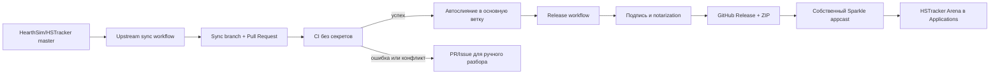

# План синхронизации, релизов и автообновления HSTracker Arena

**Статус:** готов к передаче в разработку
**Дата:** 20 июля 2026 года
**Репозиторий форка:** `serge-ml/HSTracker`
**Upstream:** `HearthSim/HSTracker`, ветка `master`
**Приложение:** `HSTracker Arena.app`
**Bundle ID:** `io.github.serge-ml.hstrackerarena`

## 1. Цель

Нужно построить полностью воспроизводимый процесс, при котором:

1. в официальном HSTracker появляется изменение;
2. форк автоматически забирает его в отдельную sync-ветку;
3. GitHub создаёт Pull Request в основную ветку форка;
4. PR автоматически сливается только после успешных тестов;
5. из новой основной ветки собирается версия HSTracker Arena;
6. приложение подписывается, упаковывается и публикуется в GitHub Releases;
7. собственный канал обновлений сообщает уже установленному приложению о новой версии;
8. приложение скачивает обновление, заменяет себя в `/Applications` и перезапускается.

Целевой поток:



## 2. Текущее состояние

На момент составления плана инфраструктура реализована частично.

| Компонент | Состояние |
|---|---|
| Уникальное имя и Bundle ID форка | Реализовано |
| Изоляция от официального канала обновлений | Реализована |
| Локальная Release-сборка | Реализована |
| Установка в `/Applications` | Реализована |
| Локальная rollback-копия | Реализована |
| CI для HearthArena и сборки приложения | Подготовлен локально |
| Плановый мониторинг парсера HearthArena | Подготовлен локально |
| Получение изменений из upstream | Подготовлен workflow, создающий PR |
| Автоматическое слияние sync-PR | Не реализовано |
| Подписанный GitHub Release | Не реализован |
| Собственный Sparkle feed | Не реализован |
| Обновление установленного приложения | Не реализовано |

Важное ограничение: текущие изменения и новые workflow ещё не являются надёжной
инфраструктурой, пока они не закоммичены, не отправлены в GitHub и не проверены
реальным запуском GitHub Actions.

## 3. Принятые архитектурные решения

### 3.1. Основная ветка

Во всех workflow следует получать имя основной ветки через
`github.event.repository.default_branch`. План не требует немедленного
переименования `master` в `main`.

### 3.2. Upstream никогда не сливается напрямую

Автоматизация всегда создаёт PR. Слияние допускается только при выполнении всех
условий:

- merge не содержит конфликтов;
- обязательные CI-проверки прошли;
- сборка Debug и Release успешна;
- тесты HearthArena успешны;
- PR создан доверенным sync-ботом;
- в PR нет изменений защищённых файлов, требующих ручного просмотра.

При конфликте PR остаётся открытым, а workflow создаёт или обновляет отдельный
Issue. Основная ветка и установленное приложение при этом не меняются.

### 3.3. Используется только собственный канал обновлений

Нельзя возвращать официальный appcast HSTracker. Форк должен иметь:

- собственный `SUFeedURL`;
- собственный публичный Sparkle EdDSA-ключ в приложении;
- приватный Sparkle-ключ только в GitHub Secrets;
- собственные GitHub Releases;
- одинаковый Bundle ID во всех версиях форка.

### 3.4. Версии монотонны

Для Sparkle каждая публикация должна иметь `CFBundleVersion` больше предыдущей.

Предлагаемая схема:

- `CFBundleShortVersionString` — совместимая маркетинговая версия HSTracker;
- `CFBundleVersion` — монотонный номер release workflow;
- Git tag — `arena-<marketing-version>-<build-number>`.

Номер сборки нельзя вычислять только из upstream-версии: в форке могут быть
собственные релизы между обновлениями официального HSTracker.

### 3.5. Два уровня подписи

Базовый личный канал:

- ad-hoc подпись macOS-приложения;
- обязательная Sparkle EdDSA-подпись архива;
- предназначен для уже доверенного приложения на личном Mac.

Рекомендуемый полноценный канал:

- постоянный сертификат `Developer ID Application`;
- hardened runtime;
- notarization у Apple;
- stapling;
- Sparkle EdDSA-подпись архива.

Для бесшовной установки на других Mac нужен второй вариант и участие в платной
Apple Developer Program. Реализацию следует строить сразу совместимой с ним,
даже если первый тест выполняется с ad-hoc подписью.

## 4. Этапы реализации

### Этап 0. Зафиксировать исходную точку

Задачи:

1. проверить полный diff текущей ветки;
2. отделить код плагина от инфраструктурных изменений, если это улучшает review;
3. закоммитить текущий рабочий MVP;
4. отправить ветку в `origin`;
5. открыть PR в основную ветку форка;
6. убедиться, что GitHub Actions действительно запускаются в удалённом репозитории.

Критерий готовности: основная ветка форка содержит воспроизводимо собираемый
HSTracker Arena и актуальные workflow.

### Этап 1. Защитить основную ветку

Настроить в GitHub:

- запрет force push и удаления основной ветки;
- обязательный Pull Request перед слиянием;
- обязательные проверки из `HSTracker Arena CI`;
- разрешение auto-merge;
- Actions permissions: `Read and write permissions`;
- разрешение GitHub Actions создавать и одобрять Pull Requests;
- GitHub Environment `release` для release-секретов.

Добавить `CODEOWNERS` минимум для:

```text
.github/workflows/
HSTracker.xcodeproj/project.pbxproj
HSTracker/Info.plist
HSTracker/HSTracker.entitlements
scripts/
```

Если sync-PR меняет эти файлы, полное автоматическое слияние должно
останавливаться до ручного просмотра. Это защищает release-секреты и build
pipeline от случайных или опасных upstream-изменений.

Критерий готовности: неуспешный CI не может попасть в основную ветку.

### Этап 2. Довести upstream sync до автоматического слияния

Базовый файл: `.github/workflows/upstream-sync.yml`.

Необходимые изменения:

1. запускать sync ежедневно и вручную через `workflow_dispatch`;
2. получать `upstream/master` с полной историей;
3. хранить последний интегрированный upstream SHA в
   `.github/upstream-base.sha` и ничего не делать, если он уже актуален;
4. создавать уникальную ветку `sync/hstracker-<upstream-sha>-<base-sha>`;
5. применять incremental diff от записанного SHA до нового upstream SHA;
6. создавать один PR и ставить labels `upstream-sync` и `automerge`;
7. включать auto-merge командой `gh pr merge --auto --merge`;
8. при конфликте создавать/обновлять Issue с SHA и ссылкой на run;
9. закрывать устаревшие sync-PR только после появления корректного нового PR;
10. не выпускать релиз непосредственно из sync workflow.

Особенность GitHub Actions: `pull_request`, порождённый встроенным
`GITHUB_TOKEN`, создаёт CI run, требующий ручного разрешения. В этом личном
форке выбран вариант без постоянного PAT: sync workflow создаёт ветку и PR
короткоживущим `GITHUB_TOKEN`, затем явно запускает CI через
`workflow_dispatch`. Для `workflow_dispatch` GitHub всегда создаёт отдельный
run на точном SHA sync-ветки; auto-merge остаётся заблокирован обязательными
checks `core` и `app`, пока они не завершатся успешно.

Прямой merge официальной истории через встроенный токен невозможен, если в
этой истории менялись `.github/workflows`: GitHub требует отдельное
долгоживущее credential с `workflows`-доступом. Поэтому sync переносит
incremental diff одним аудируемым commit, исключает официальные workflow-файлы
и оставляет delivery pipeline во владении форка. Новый upstream SHA записывается
в marker только в том же PR, который содержит соответствующие изменения.

Права `Actions: write`, `Contents: write`, `Issues: write` и
`Pull requests: write` выдаются встроенному токену только для sync job.
Постоянный `UPSTREAM_SYNC_TOKEN` не требуется.

Критерий готовности: тестовый безопасный upstream commit автоматически проходит
путь от обнаружения до merge; сломанная тестовая ветка не сливается.

### Этап 3. Сделать CI обязательным шлюзом

Базовый файл: `.github/workflows/heartharena-ci.yml`.

CI должен выполняться без release-секретов и включать:

- проверку идентичности форка;
- запрет официального feed и официальных ключей;
- unit-тесты HearthArena;
- smoke-тесты parser, mapping, adapter и layout;
- `plutil -lint`;
- разрешение Swift packages;
- unsigned Debug build;
- unsigned Release build;
- сохранение unsigned Release artifact для следующего этапа;
- отдельную плановую проверку живой HearthArena tier list.

Для защиты от случайных пропусков workflow должен иметь триггеры:

- `pull_request`;
- `push` в основную ветку;
- `workflow_dispatch`;
- `schedule` только для parser health.

Критерий готовности: CI обнаруживает ошибку интеграции с upstream до merge, а
успешный run оставляет воспроизводимый Release artifact и его SHA-256.

### Этап 4. Вернуть Sparkle с идентичностью форка

Добавить актуальную стабильную Sparkle 2.x через Swift Package Manager и
зафиксировать версию зависимости.

Изменения приложения:

1. подключить Sparkle только к target HSTracker Arena;
2. создать updater controller при старте приложения;
3. добавить `Check for Updates…` в меню;
4. добавить настройку автоматической проверки обновлений;
5. настроить фоновую проверку без показа окна при отсутствии обновления;
6. добавить в `Info.plist` собственные `SUFeedURL` и `SUPublicEDKey`;
7. не хранить приватный EdDSA-ключ в репозитории;
8. логировать проверку, найденную версию и ошибку установки без секретных данных;
9. сохранить существующий Bundle ID и стабильное designated requirement.

Предлагаемый стабильный URL:

```text
https://serge-ml.github.io/HSTracker/appcast.xml
```

GitHub Pages должен публиковать только feed и при необходимости release notes.
ZIP приложения остаётся asset соответствующего GitHub Release.

На переходном этапе CI-проверку «Sparkle полностью отсутствует» нужно заменить
на проверки:

- официальный feed отсутствует;
- подключён только feed форка;
- публичный ключ соответствует release pipeline;
- приватный ключ отсутствует в git.

Критерий готовности: установленная тестовая версия открывает собственный feed и
никогда не обращается к официальному updater HSTracker.

### Этап 5. Реализовать подписанный release workflow

Создать `.github/workflows/release.yml`.

Рекомендуемый запуск:

- после успешного CI для commit в основной ветке;
- вручную через `workflow_dispatch`;
- с `concurrency`, запрещающим два параллельных релиза одного commit.

Workflow должен:

1. убедиться, что commit ещё не опубликован;
2. получить именно проверенный CI artifact либо повторить детерминированную сборку;
3. назначить монотонный `CFBundleVersion`;
4. проверить Bundle ID, entitlements и встроенные ресурсы;
5. подписать все вложенные frameworks, helpers и само приложение;
6. проверить подпись через `codesign --verify --deep --strict`;
7. при наличии Developer ID отправить архив на notarization;
8. выполнить stapling и повторную проверку через `spctl`;
9. упаковать `.app` командой `ditto`;
10. подписать ZIP приватным Sparkle EdDSA-ключом;
11. создать Git tag и GitHub Release;
12. приложить ZIP, SHA-256 и release notes;
13. сгенерировать новый `appcast.xml`;
14. атомарно опубликовать appcast через GitHub Pages;
15. проверить доступность ZIP и feed по HTTPS;
16. только после этих проверок пометить релиз как не-draft.

Release job с секретами не должен запускать произвольные скрипты из PR.
Предпочтительная схема безопасности:

1. CI без секретов собирает unsigned artifact;
2. release job скачивает artifact по точному commit SHA;
3. release job только проверяет, подписывает, notarize и публикует artifact;
4. код приложения в release job не исполняется.

### Этап 6. Настроить секреты

Для sync постоянные secrets не нужны: workflow использует короткоживущий
встроенный `GITHUB_TOKEN` и явно запускает required CI через
`workflow_dispatch`.

Для Sparkle:

| Secret | Назначение |
|---|---|
| `SPARKLE_ED_PRIVATE_KEY` | Подпись update-архива |

Для Developer ID:

| Secret | Назначение |
|---|---|
| `DEVELOPER_ID_CERTIFICATE_BASE64` | Экспортированный `.p12` |
| `DEVELOPER_ID_CERTIFICATE_PASSWORD` | Пароль `.p12` |
| `TEMP_KEYCHAIN_PASSWORD` | Временный keychain runner |
| `APPLE_ID` | Учётная запись notarization |
| `APPLE_TEAM_ID` | Team ID |
| `APPLE_APP_SPECIFIC_PASSWORD` | App-specific password |

Секреты должны находиться в GitHub Environment `release`. В логах нельзя
выводить содержимое keychain, приватного Sparkle-ключа или пароли.

Критерий готовности: секреты доступны только release job и не доступны CI,
запущенному из Pull Request.

### Этап 7. Сквозной тест обновления

Проверка выполняется двумя реальными версиями.

Версия N:

1. установить в `/Applications/HSTracker Arena.app`;
2. выдать необходимые разрешения macOS;
3. убедиться, что трекер и HearthArena overlay работают;
4. убедиться, что версия N не предлагает саму себя.

Версия N+1:

1. внести видимое безопасное изменение версии;
2. провести его через PR, CI и release workflow;
3. дождаться автоматической проверки или нажать `Check for Updates…`;
4. подтвердить корректное отображение release notes;
5. скачать и установить обновление через Sparkle;
6. проверить автоматический перезапуск;
7. проверить фактическую версию в `/Applications`;
8. проверить трекер, Arena overlay и доступ к Hearthstone;
9. перезагрузить Mac и повторно проверить запуск;
10. убедиться, что разрешения Accessibility/Input Monitoring не потерялись.

Дополнительно проверить:

- повреждённая подпись ZIP отклоняется;
- более старая версия не устанавливается поверх новой;
- недоступный feed не ломает запуск приложения;
- неуспешный release не публикует appcast;
- конфликт upstream не меняет текущую установленную версию.

Критерий готовности: версия N самостоятельно и безопасно обновляется до N+1 в
`/Applications` без Xcode, Terminal и ручного копирования `.app`.

### Этап 8. Документация и эксплуатация

Обновить `HEARTHARENA.md` и `README.md`:

- как работает upstream sync;
- где смотреть sync-PR и ошибки;
- как вручную запустить CI, sync и release;
- как отозвать неудачный релиз;
- как временно отключить автоматические обновления;
- как восстановить предыдущую версию;
- как ротировать sync token и Sparkle-ключ;
- как обновить Developer ID certificate;
- как проверить установленную подпись и версию.

Сохранить `scripts/hstracker_arena_app.sh` как локальный development path:

- `build` — локальная сборка;
- `install` — локальная установка;
- `rollback` — локальный откат;
- `status` — диагностика.

Этот скрипт не является пользовательским каналом доставки после появления
Sparkle, но остаётся аварийным и разработческим инструментом.

## 5. Политика автоматического выпуска

### Рекомендуемый стартовый режим

1. upstream sync полностью автоматический;
2. sync-PR получает auto-merge после required checks;
3. защищённые файлы требуют ручного review;
4. release создаётся автоматически после merge;
5. GitHub Environment временно требует ручного подтверждения release job;
6. после нескольких успешных циклов подтверждение можно убрать.

Такой режим сначала проверяет весь путь, но не отдаёт signing secrets новому
upstream-коду без контроля.

### Полностью автоматический режим

После стабилизации можно убрать ручное подтверждение release environment. Тогда
весь путь от upstream commit до обновления приложения будет автоматическим.

Остающийся риск: прошедшее CI изменение upstream автоматически попадёт в
подписанное приложение. Это осознанный supply-chain риск, поэтому защищённые
файлы и обязательные проверки нельзя исключать ради скорости.

## 6. Обработка сбоев

| Сбой | Ожидаемое поведение |
|---|---|
| Upstream недоступен | Workflow завершается ошибкой, основная ветка не меняется |
| Нет новых commit | Workflow успешно завершается без PR |
| Merge conflict | Создаётся Issue, автоматическое слияние не выполняется |
| CI failed | PR остаётся открытым, релиза нет |
| Release build failed | Старый appcast остаётся действующим |
| Подпись или notarization failed | Release остаётся draft или не создаётся |
| Appcast publish failed | Новый релиз не объявляется установленным приложениям |
| ZIP повреждён | Sparkle отклоняет update по EdDSA-подписи |
| Feed недоступен | Приложение продолжает работать на текущей версии |
| Новая версия сломана | Предыдущий release остаётся доступным для ручного rollback |

Ключевое правило публикации: сначала полностью готовый и проверенный release,
потом обновление appcast. Никогда наоборот.

## 7. Критерии готовности всей системы

Работа считается завершённой, когда одновременно выполнено следующее:

- новые upstream commit обнаруживаются без ручного `git pull`;
- на каждое изменение создаётся только один sync-PR;
- PR не может слиться при красном CI;
- чистый PR сливается автоматически;
- конфликт не повреждает основную ветку;
- merge основной ветки создаёт уникальную монотонную версию;
- Release содержит подписанный ZIP и SHA-256;
- appcast принадлежит форку и содержит валидную Sparkle-подпись;
- официальные feed и ключи HSTracker отсутствуют;
- установленная версия находит N+1;
- Sparkle обновляет приложение непосредственно в `/Applications`;
- после обновления сохраняются данные, настройки и macOS permissions;
- трекер и HearthArena overlay работают после перезапуска;
- процедура rollback задокументирована и проверена.

## 8. Порядок выполнения для следующего исполнителя

Необходимо выполнять задачи в таком порядке:

1. закоммитить и отправить текущий MVP;
2. активировать CI в GitHub;
3. настроить branch protection;
4. исправить token-модель upstream sync;
5. доказать автоматический sync-PR и auto-merge;
6. добавить Sparkle с собственным тестовым feed;
7. создать Sparkle-ключи;
8. реализовать release workflow сначала с ad-hoc подписью;
9. провести тест N → N+1;
10. подключить Developer ID и notarization;
11. повторить тест N → N+1;
12. после нескольких успешных циклов решить, убирать ли ручное подтверждение
    production release.

Не начинать с полного auto-release: сначала должны быть доказаны CI, собственный
feed и сквозное обновление двух тестовых версий.

## 9. Файлы, которые предстоит создать или изменить

Ожидаемый минимальный набор:

```text
.github/CODEOWNERS
.github/workflows/heartharena-ci.yml
.github/workflows/upstream-sync.yml
.github/workflows/release.yml
HSTracker/Info.plist
HSTracker/AppDelegate.swift
HSTracker/UIs/Base.lproj/MainMenu.xib
HSTracker.xcodeproj/project.pbxproj
HSTracker.xcodeproj/project.xcworkspace/xcshareddata/swiftpm/Package.resolved
scripts/hstracker_arena_app.sh
HEARTHARENA.md
README.md
```

Допустимо вынести updater-интеграцию в отдельный каталог, например:

```text
HSTracker/Updater/
├── UpdateController.swift
├── UpdateSettings.swift
└── UpdateDiagnostics.swift
```

Это уменьшит число изменений в upstream-коде и упростит будущие синхронизации.
